### 简述
1. 降低u3d游戏找关键函数难度（按img/cls添加批量断点）
2. 单独提出一些常用函数的通用Hook
3. 方便函数调用测试,函数动态参数解析
4. 对class指针解析内存数据(fields)

### 使用
1. 在U3d游戏启动之后,使用 **frida -FU -l ...\Ufun.js** 进行attach
2. B() 即可对程序集Assembly-CSharp中的方法进行全部断点,也可自行使用 i() , a() 进行添加后在使用 B("Filter") 进行断点
3. 一些常用的hook都使用 Hook... 开头命名 (欢迎各位大佬继续拓展)
4. 函数调用使用 callfunction() ,第一个参数为函数地址,后面的参数是参数值; setFunctionValue() 快速的修改函数返回值
5. breakWithArgs() 断点函数并显示指定个数参数; breakInline() 任意位置
6. 还有一个 b() 方法会用的比较频繁,b()方法的参数是一个methodinfo指针,用于对参数的识别和解析,find_method()和B()断点括号用的都能找到
7. 还有一系列的get/set方法用来操作gameobj/transform等等
8. SeeTypeToString() 帮我们快速的判断当前指针的类型, m() 参数也是一个cls指针,帮我们确认类方法
9. listClsFromMethodInfo() 通过一个类方法的methodinfo回溯到它对应的cls下的其他方法信息
   
以上为一些个人总结的比较常用的api

#### tips:

使用的两个数组是兼容之前使用python脚本查找function的方法
可以多次使用AddBP(img/cls)添加多个类或者img的方法到这个两个数组
方法添加完成后建议使用print_list_result()列出当前方法，然后手动替换掉开始部分的arrayAddr和arrayName

---
<pre>
/**
 * --------------------------------------------------------------------------------------------
 * 常用
 * ---------------------
 * i()      list_Images()
 * c()      list_Classes(image,isShowClass) // 遍历调用
 * C()      list_Classes(imgOrPtr)          // 反射调用
 * m()      list_Methods(klass,isShowMore)
 * f()      listFieldsFromCls(klass)
 * F()      find_method(ImageName,ClassName,functionName,ArgsCount,isRealAddr)
 * n()      nopfunction(ptr)
 * nn()     cancel nopfunction(ptr)
 * nnn()    cancel all nop/replace function
 * d()      Interceptor.detachAll() / d(mPtr) detach mPtr
 * a()      addBreakPoints(imgOrCls)
 * b()      breakPoint(mPtr)
 * P()      printCtx(pointer,range)
 * B()      breakPoints(filter)
 * D()      detachAll and reset arrays
 * p()      print_list_result(filter)
 * --------------------------------------------------------------------------------------------
 * 拓展方法
 * ---------------------
 * HookSetActive()
 * HookOnPointerClick()
 * HookPlayerPrefs()
 * HookDebugLog()
 * HookLoadScene()
 * HookGetSetText()
 * PrintHierarchy()
 * getUnityInfo()
 * getApkInfo()
 * GotoScene(str)
 * callFunction(mPtr,arg0,arg1,arg2,arg3)
 * SeeTypeToString(obj)
 * FuckKnownType(strType,mPtr)
 * Toast(msg)
 * getLibPath()
 * print_deserted_methods()
 * 
 * --- 用作动态Hook去掉指定gameObj
 * setClick()
 * HideClickedObj()
 * HookMotionEvent()
 * 
 * --- 查看对象
 * showEventData(eventData)
 * showTransform(transform)
 * showEventData(eventData)
 * 
 * --- 修改属性
 * destroyObj(gameObj)
 * setActive(gameObj,visible)
 * setPosition(mTransform,x,y,z)
 * setLocalScale(mTransform,x,y,z)
 * setLocalPosition(mTransform,x,y,z)
 * setLocalRotation(mTransform,x,y,z,w)
 * ----------------------------------------------------------------------
 * SharedPrefs                                                          |
 * ---------------------------------------------------------------------|
 * SetInt(key,value)    | SetFloat(key,value)   | SetString(key,value)  |
 * GetInt(key)          | GetFloat(key)         | GetString(key)        |
 * ----------------------------------------------------------------------
 * PS:  分清楚 MethodInfo,Transform,GameObject 指针类型, 调用函数的时候不要瞎传参数
 *      如果使用了gadgat,使用-FU先把应用跑起来再进行注入该脚本, 整个脚本对spawn方式启动的兼容性不好
 * --------------------------------------------------------------------------------------------
 */
</pre>

```
// 2021.2.7f1c1
// typedef struct MethodInfo {
//     Il2CppMethodPointer methodPointer;
//     Il2CppMethodPointer virtualMethodPointer;
//     InvokerMethod invoker_method;
//     const char * name;
//     Il2CppClass * klass;
//     const Il2CppType * return_type;
//     const Il2CppType ** parameters;

** 遇到不可用的时候 MethodInfoOffset 可尝试修改为 0x0 / 0x1 **
var MethodInfoOffset = 0x0
```


### 用例
1. **list_Images()   ===   i()**
   
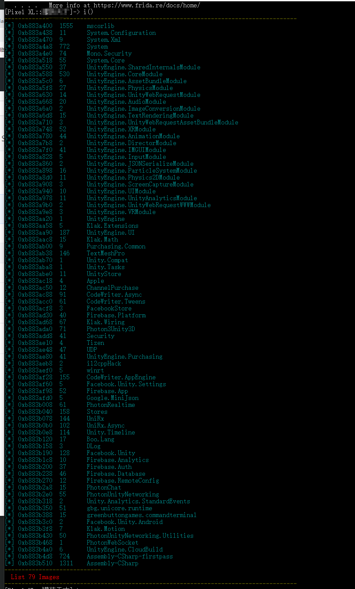

2. **list_Classes(image,isShowClass)   ===   c()**
   
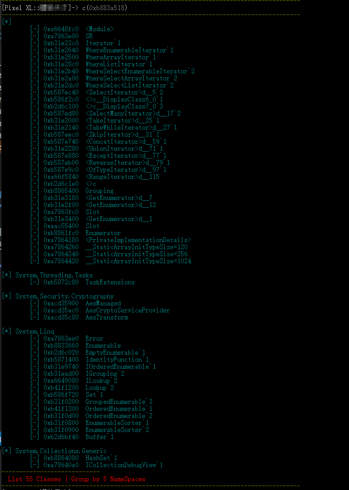

3. **list_Methods(klass,isShowMore)   ===   m()**
   
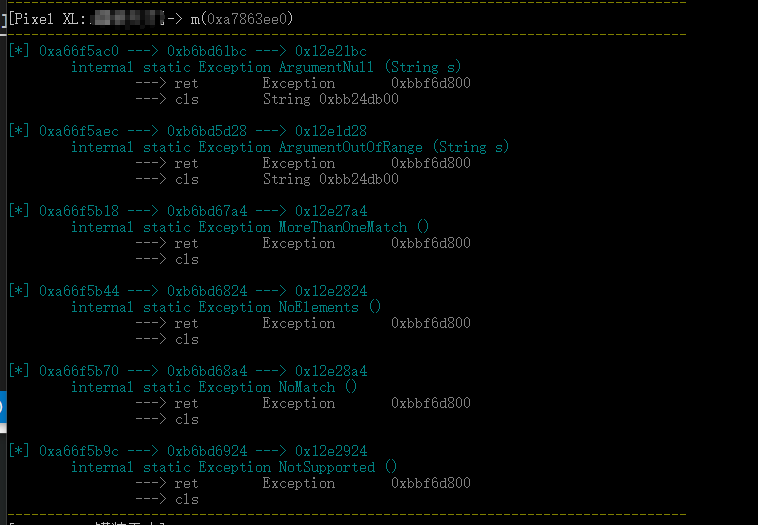

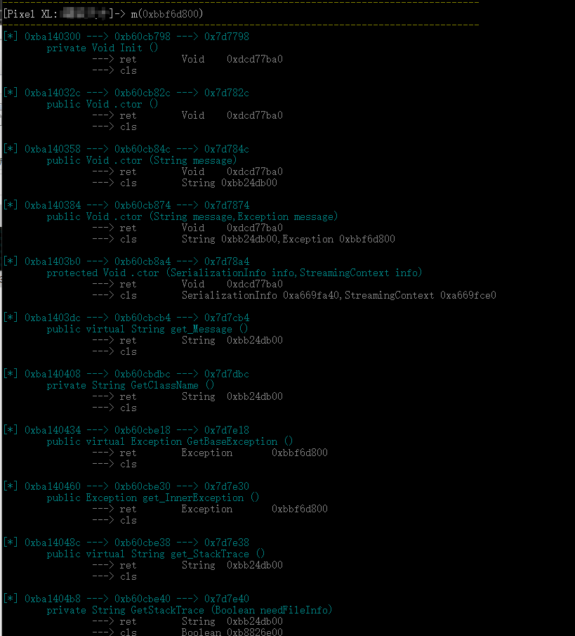

4. **find_method(ImageName,ClassName,functionName,ArgsCount,isRealAddr)   ===   f()**
   
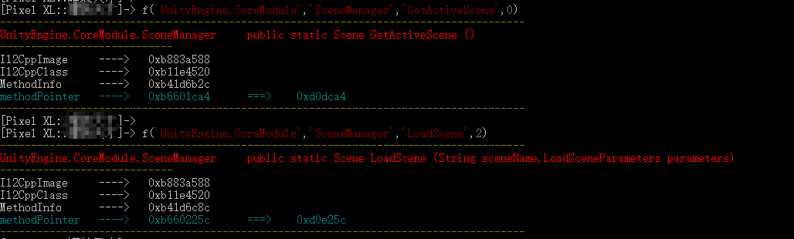

5. **addBP(imgOrCls)   ===   a()**
   
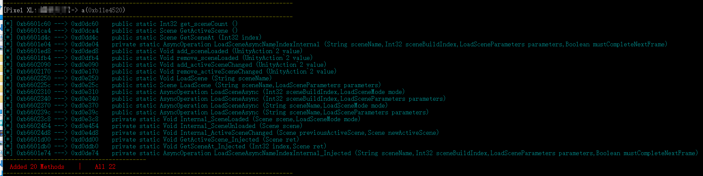

6. **breakPoints(filter)   ===   B()**
   
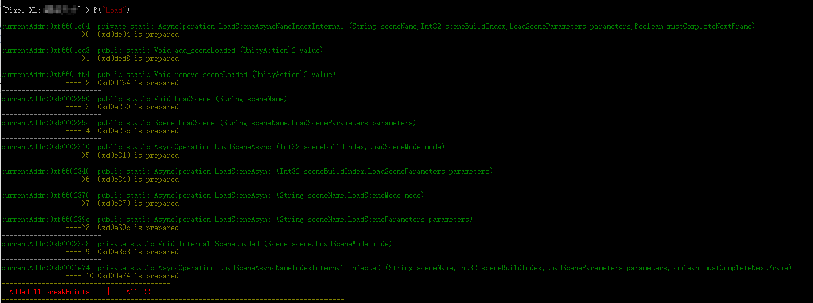

7. **breakPoint(ptr)   ===   b()**
   
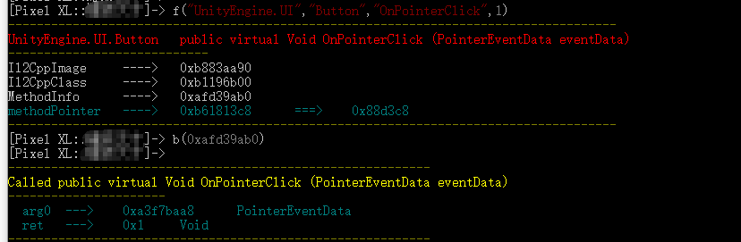

8. **Interceptor.detachAll()   ===   d()** 

9. **HookOnPointerClick()**
   
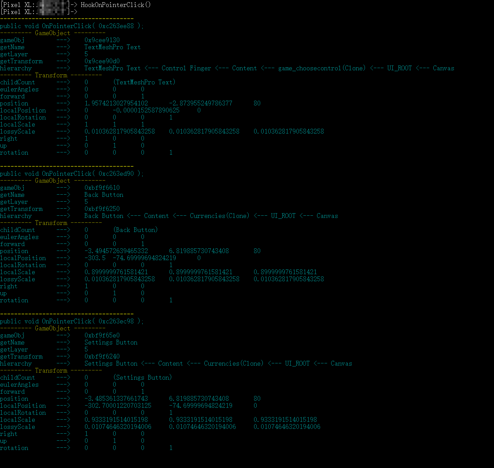

10. **Info()**
   
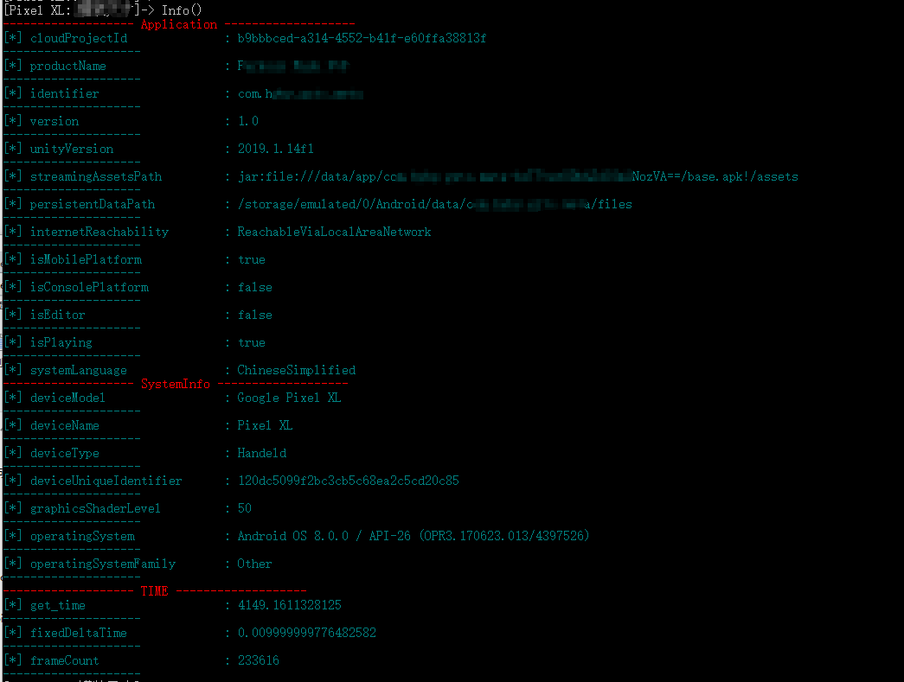

10. **FindObjectsOfType()**
   
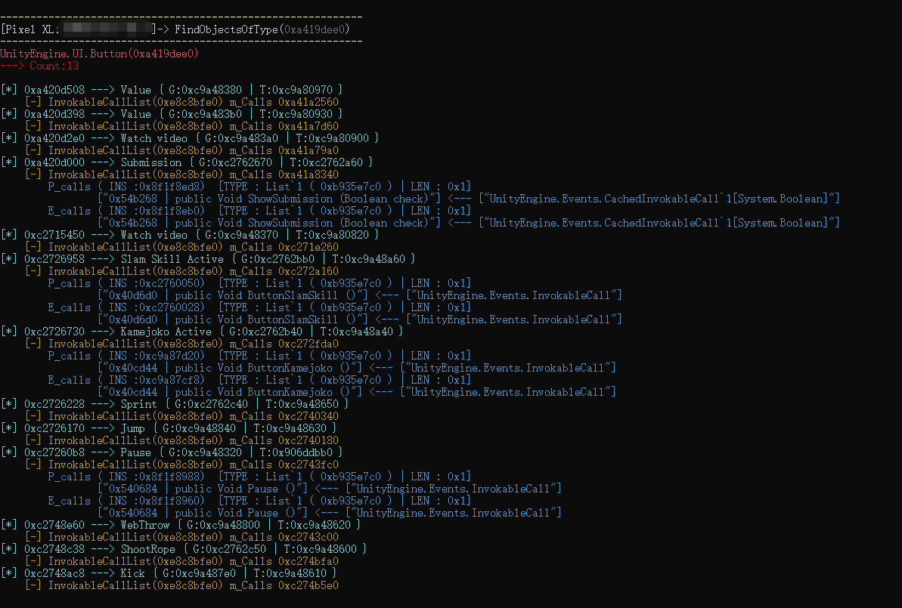

....
