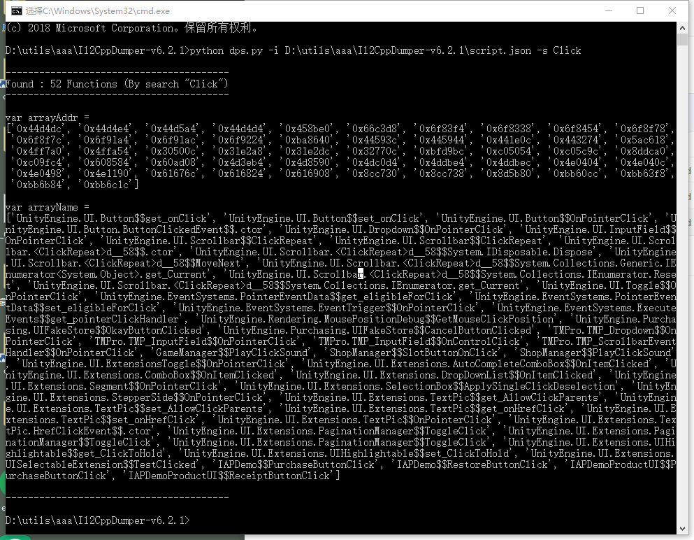
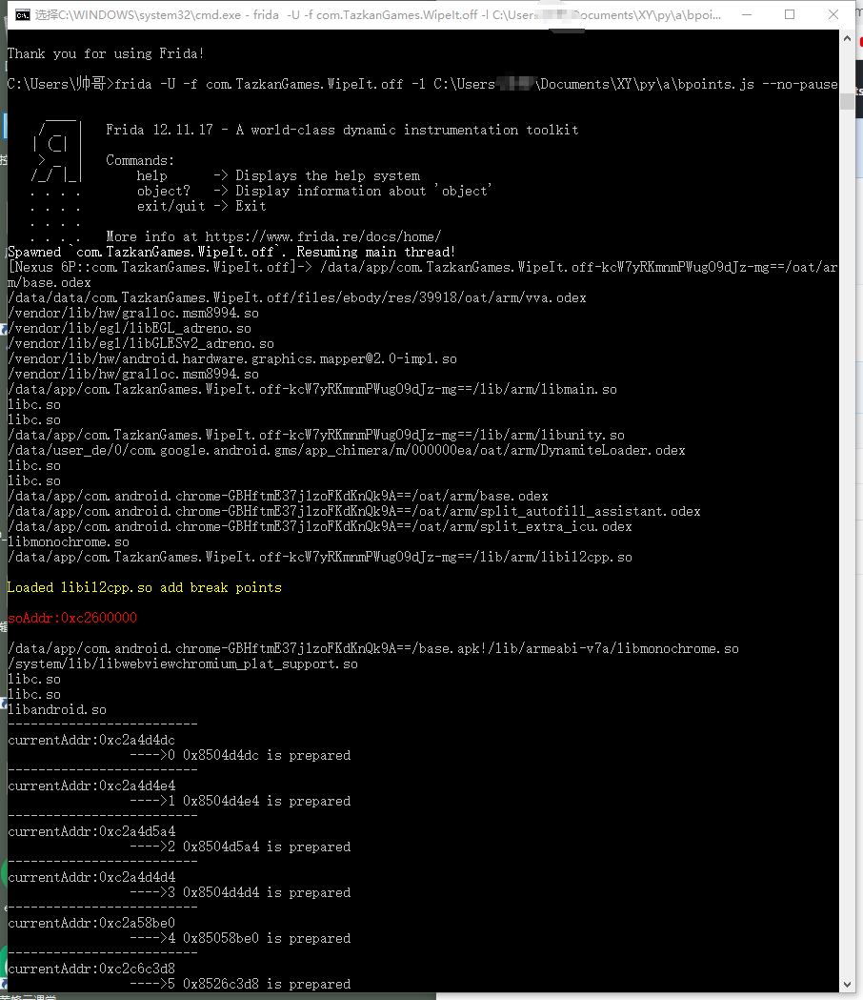
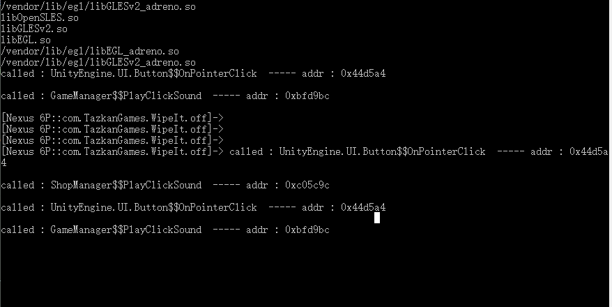

# Il2CppDumperTool
该脚本用来批量断点libil2cpp.so的函数
<pre>
1. dps.py

主要用来为Il2CppDumper生成的script.json提供一个关键字搜索，并转换为地址与名称对应关系，便于bpoints.js使用

2. bpoints.js

frida使用的js脚本，用到dlopen来获得加载时机，并注入断点
</pre>

###### python脚本的使用
 "bpoints.js")

cp上述结果到 bpoints.js 中替换对应的部分，再用frida去加载这段js即可批量断点以上函数

###### 添加对libil2cpp.so的函数断点

###### 点击按钮触发函数回调

###### 这三个暴力使用，容易崩，不建议使用 
HookExports,HookImports,HookSymbols
